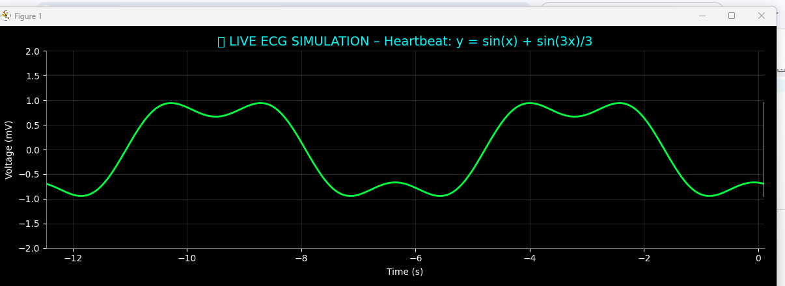

# ❤️ Heartbeat Monitor
# 🏥 Live ECG Simulator

A real-time electrocardiogram (ECG) simulation that visualizes a synthetic heartbeat waveform with R-peak detection — styled like a hospital monitor.



> 💡 **Note**: The animation runs live when you execute the script. The GIF above is a placeholder — your local version will be smooth and interactive!

## 📊 Features
- Realistic **dark-themed ECG display** (black background, green trace, gray grid)
- **Scrolling waveform** that mimics real-time monitoring
- **R-peak detection** with red markers (simulating the strongest part of the heartbeat)
- Mathematically modeled heartbeat:  
  `y = sin(x) + sin(3x)/3` (approximates a real QRS complex)

## 🚀 How to Run

1. **Clone or download** this repository
2. **Install dependencies**:
   ```bash
   pip install numpy matplotlib